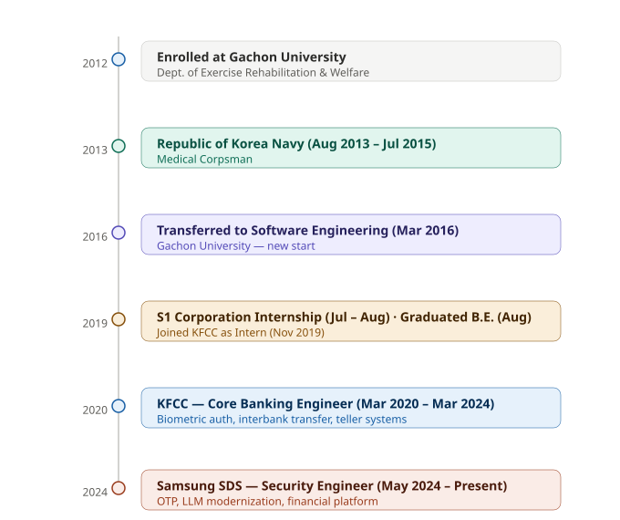

# Hyeonsun Jung (Jason) 👋
**Software Engineer → Security Researcher**  
Interested in Usable Security, Human-Centered Authentication, and Human-AI Interaction

---

## About Me

I am a software engineer with 6+ years of experience building secure financial systems at Samsung SDS and the Korean Federation of Community Credit Cooperatives (KFCC). Throughout my career, I have been less interested in technology as an end in itself and more interested in the relationship between people and the systems they depend on.

I am currently preparing to pursue a Master's degree in Computer Science, with a research focus on **usable security**, **human-centered authentication**, and **human-AI interaction**. My long-term goal is to earn a PhD and contribute to the design of secure systems that people can not only use, but confidently trust.

---

## Research Interests

- Usable Security and Human-Centered Authentication
- Human-Computer Interaction for Financial Security Systems
- Biometric and Multi-Factor Authentication UX
- Human-AI Interaction and Trustworthy AI Systems
- Privacy-Preserving Systems

---

## Career Timeline

---

## Professional Experience

**Software Engineer** @ Samsung SDS *(May 2024 – Present)*  
Full-stack security engineer working on mobile/browser OTP systems, LLM-based legacy modernization, and financial platform development.

**Software Engineer** @ Korean Federation of Community Credit Cooperatives *(Nov 2019 – Mar 2024)*  
Core banking developer responsible for biometric authentication systems, interbank transfer networks, and teller terminal infrastructure.

---

## Selected Projects

| Project | Organization | Key Focus |
|--------|-------------|-----------|
| [Palm-Vein Biometric Authentication](https://github.com/Jasonarea/palm-vein-biometric-auth) | KFCC | Usable Security, Biometric UX |
| [Bulk Interbank Transfer System](https://github.com/Jasonarea/bulk-interbank-transfer) | KFCC | Security + Usability, Async UX |
| [Monimo Financial Platform](https://github.com/Jasonarea/monimo-financial-platform) | Samsung SDS | Human-AI Interaction, Trustworthy AI |
| [Mobile OTP / MFA System](#) | Samsung SDS | Authentication, Cryptographic Workflows |

---

## Education

**B.E. in Software Engineering** — Gachon University *(Mar 2012 – Aug 2019)*  
GPA: 3.84/4.5 (Major: 3.94/4.5)  
Completed core coursework in data structures, algorithms, operating systems, databases, and computer networks.

**Undergraduate Research Assistant** — Gachon University HCI Lab *(Jan 2017 – Mar 2017)*  
Joint research project with Samsung Electronics (Government-Funded).  
Feasibility Study on Privacy-Aware Architecture for PPG-Based Wearable Blood Pressure Monitoring.

---

## Skills

**Languages:** Java, C, Python, JavaScript, SQL  
**Security:** Mobile OTP, MFA, Biometric Authentication, Cryptographic Workflows  
**Infrastructure:** FEP, Interbank Networks, Core Banking Modules  
**Engineering:** Spring, Vue.js, Oracle SQL, MSA, TDD, Mockito  
**AI/ML:** LLM, LangChain, Reverse Engineering Agents  

---

## Creative Work

I have spent the past three years composing and producing music using Logic Pro.  
I am preparing to release my debut album, which has deepened my interest in the intersection of **music technology and security** — particularly how intelligent creative interfaces can be designed with both usability and privacy in mind.

---

## Languages

🇰🇷 Korean (Native) · 🇺🇸 English (Professional) · 🇯🇵 Japanese (Basic)

---

> *"Security is ultimately effective only when people can adopt it naturally as part of their everyday workflow."*
